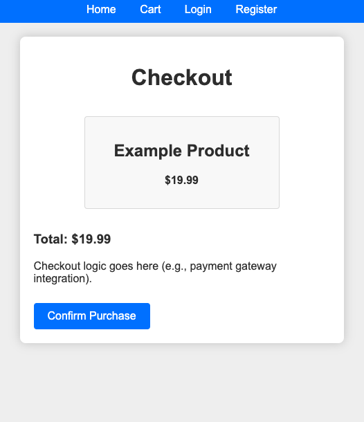

# Simple E-commerce Store

## Overview

The Simple E-commerce Store is a Flask-based web application that allows users to browse products, add them to a cart, and proceed to checkout. The application features user registration and login, and an admin panel for adding new products.

## Features

- User registration and login.
- Browse and view products.
- Add products to a shopping cart.
- Simple checkout process.
- Admin panel for adding new products.
- Responsive design.

## Prerequisites

- Python 3.6 or higher
- Flask
- Flask-SQLAlchemy
- Flask-WTF

## Installation

1. Clone the repository:
   ```bash
   git clone https://github.com/gouthamyadavalli/ecommerce-store.git
   cd ecommerce-store
2. Set up a virtual environment and install dependencies:
    ```bash
    python -m venv venv
    source venv/bin/activate  # On Windows use `venv\Scripts\activate`
    pip install -r requirements.txt
    ```
3. Configure the `config.py` file:
    ```python
    class Config:
        SECRET_KEY = 'your_secret_key'
        SQLALCHEMY_DATABASE_URI = 'sqlite:///ecommerce.db'
        SQLALCHEMY_TRACK_MODIFICATIONS = False
    ```
4. Initialise the database:
    ```
    flask shell
    from app import db
    db.create_all()
    exit()
    ```
4. Run the application:
    ```bash
    flask run
    ```
5. Open your browser and navigate to `http://127.0.0.1:5000/` to use the E-commerce Store.

## Usage
 - *Admin Panel*: Use the `/admin/add_product route` to add new products.
 - *User Actions*: Register and log in to add products to the cart and proceed to checkout.




